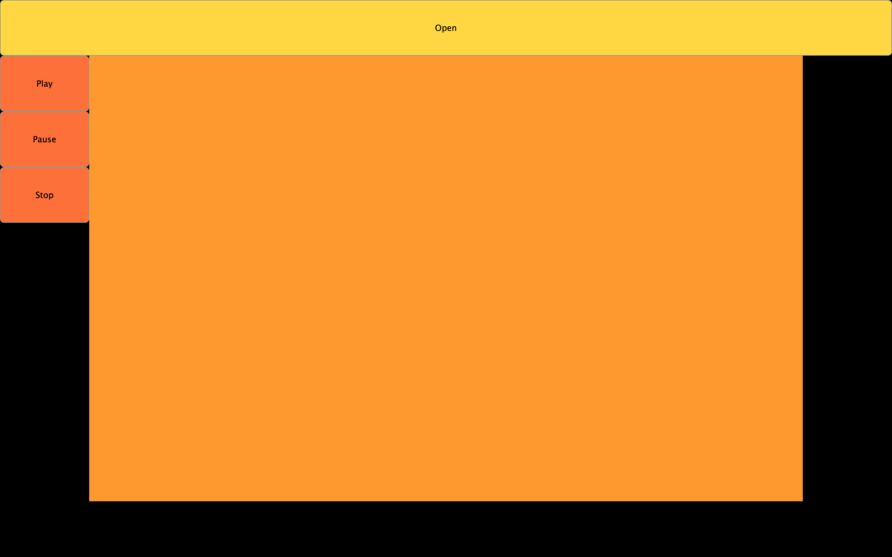

# Final Project
This repository contains the source files I used to create my application, a report of my research, and links to websites that I found useful.

* The application is a cross-platform audio spectrum analyzer. It has the following features:
    * Loads in common audio file types (.mp3, .wav, etc.) for playback.
    * Has a transport bar displaying the position in the audio file.
    * Shows nine octaves.
    
* I made this project using the JUCE framework, which specializes in creating audio applications for use in music.

## To Compile the Project Yourself
* The JUCE 5 Library is provided on GitHub, [here](https://github.com/WeAreROLI/JUCE "JUCE 5 Library on GitHub"). Clone the repository to a directory on your file system. The necessary source files that are used to compile my code are in JUCE/modules.
* Alternatively, go to the JUCE website and download the most current version of JUCE. Contained within ~/JUCE there is application called Projucer. Opening the application will present you with a window with options for creating a project. Choosing the "Audio Application" will begin creating a new application. You may choose an IDE to open the project in (Xcode for OS X, Visual Studio for Windows) and click on the icon in the upper right for the IDE. This will open the project in your IDE of choice. In the "Source" folder of the IDE delete the two auto-generated files and include my source files.

## Useful links:
* The Scientist and Engineer's Guide to Digital Signal Processing, by Steven W. Smith, Ph.D. He offers the digital version of his book [here](http://dspguide.com/pdfbook.htm "The Scientist and Engineer's Guide to Digital Signal Processing's Table of Content").
* You can learn about JUCE [here](https://juce.com/ "JUCE | JUCE").
* JUCE's class index can be found [here](https://docs.juce.com/master/classes.html "JUCE: Class Index").
* Mark Finke's blog on making an audio plug-in is located [here](http://www.martin-finke.de/blog/tags/making_audio_plugins.html "Mark Finke's Blog").

## Here's a picture of my app:

