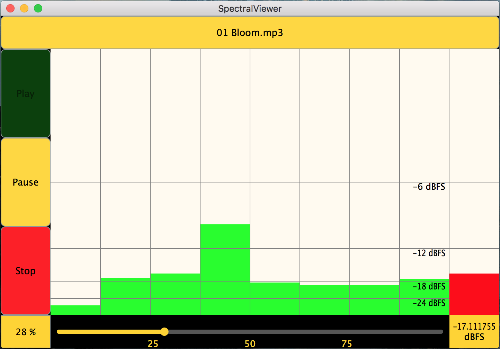

# Final Project
This repository contains the source files I used to create my application, a report of my research, and links to websites that I found useful. Look under the "Report" folder in this repository to find my research on digital signal processing and what I discovered about JUCE/a report of my process and my struggles. The source files are in the "Source" folder.

* The application is an audio spectrum analyzer. It is made with the a collection of modules, the JUCE framework, that supports basic to complex audio functions. My application hosts these features:
    * Audio playback in many common audio file types (.wav, .mp3, .aiff, .flac, etc.)
    * Spectrum display that shows 8 octaves, which can be frozen by clicking on the display.
    * An RMS meter that shows the gain of the waveform in dBFS.
    * Play, pause, and stop buttons that smoothly fade in/out audio.
    * A transport bar to easily select certain sections of a recording.

## To Compile the Project Yourself
* The JUCE 5 Library is provided on GitHub, [here](https://github.com/WeAreROLI/JUCE "JUCE 5 Library on GitHub"). Clone the repository to a directory on your file system. The necessary source files that are used to compile my code are in JUCE/modules.
* Alternatively, go to the JUCE website and download the most current version of JUCE (JUCE 5.3). Contained within .../JUCE is an application called Projucer. Opening the application will present you with a window with options for creating a project. Choosing the "Audio Application" will begin creating a new application. In the files tab, under "File Explorer" delete the existing files and right click to "Add Exisiting Files". Add my source files to the Projucer. Then click "Modules" and make sure that the juce_dsp module has been included in the project. If so, you may choose an IDE to open the project in (Xcode for OS X, Visual Studio for Windows) and click on the icon in the upper right to open the IDE. This will open the project in your IDE of choice.

## Useful links:
* The Scientist and Engineer's Guide to Digital Signal Processing, by Steven W. Smith, Ph.D. He offers the digital version of his book [here](http://dspguide.com/pdfbook.htm "The Scientist and Engineer's Guide to Digital Signal Processing's Table of Content").
* You can learn about JUCE [here](https://juce.com/ "JUCE | JUCE").
* JUCE's class index can be found [here](https://docs.juce.com/master/classes.html "JUCE: Class Index").
* JUCE's forum, which may answer some of your questions is [here](https://forum.juce.com/ "JUCE: Forum").
* Mark Finke's blog on making an audio plug-in is located [here](http://www.martin-finke.de/blog/tags/making_audio_plugins.html "Mark Finke's Blog").

## Here's a picture of my app:

* And here's [a link to a video](https://drive.google.com/file/d/15JP6mvoeYjkq1Pq9BZY8vbRnD7ocD0UC/view?usp=sharing "Google Drive Movie") of me using the app. 
    * If the previous link didn't work, you can find my video on YouTube [here](https://www.youtube.com/watch?v=PXtUD59HWoY&feature=youtu.be "App Demo").
And, if you are using OS X, here's [the OS X version of the app](https://drive.google.com/drive/folders/1QNt7Qeyj8qh5hkbJtLkiXDZrUTzV-Fpw?usp=sharing "Google Drive App") compiled using c++14 with Xcode's compiler LLVM 9. To download the app, download the entire SpectralView.app folder, and the application should be located in the MacOS folder.
